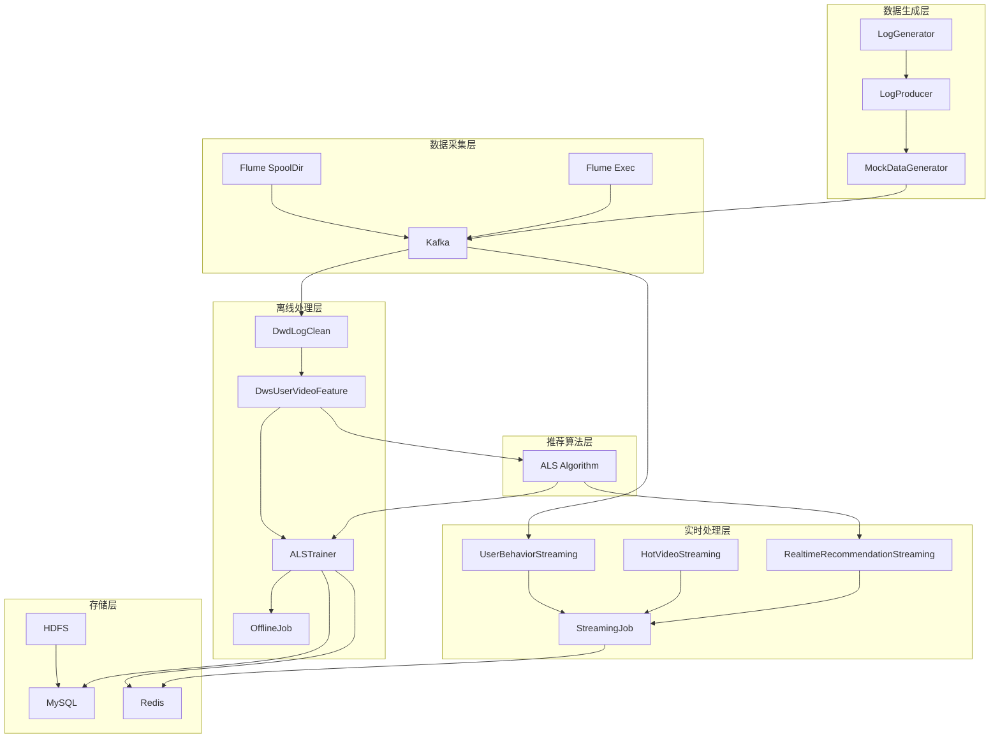

# 短视频推荐系统 - 大数据引擎架构文档

## 项目概述

短视频推荐系统的大数据引擎部分采用Lambda架构，结合离线批处理和实时流处理，为短视频平台提供个性化推荐服务。该系统主要包括数据生成、数据采集、离线处理、实时处理、推荐算法和存储等多个组件。

## 整体架构



## 技术栈

- **Spark**: 使用Spark Core、SQL、Streaming和MLlib进行数据处理和机器学习
- **Kafka**: 作为实时数据流的消息中间件
- **Hadoop/HDFS**: 用于分布式存储原始数据和处理结果
- **Flume**: 用于日志收集和传输
- **Redis**: 用于缓存推荐结果和热点数据
- **MySQL**: 存储元数据和最终推荐结果
- **Scala**: 主要开发语言

## 文件组成结构

```
bigdata-engine/
├── conf/
│   ├── flume-conf.properties          # Flume SpoolDir配置
│   └── flume-exec-conf.properties     # Flume Exec配置
├── logs/                            # 日志目录
├── metastore_db/                    # 元数据库目录
├── scripts/
│   └── run_offline_pipeline.bat     # 离线分析运行脚本
├── src/main/scala/com/shortvideo/recommendation/
│   ├── als/                         # 推荐算法模块
│   │   ├── model/
│   │   │   └── Rating.scala         # 评分模型定义
│   │   ├── storage/
│   │   │   ├── HDFSStorage.scala    # HDFS存储组件
│   │   │   └── MySQLWriter.scala    # MySQL写入组件
│   │   ├── ALSTrainer.scala         # ALS协同过滤训练器
│   │   ├── DataProcessor.scala      # 数据处理器
│   │   └── ModelEvaluator.scala     # 模型评估器
│   ├── common/                      # 公共组件
│   │   ├── config/
│   │   │   ├── AppConfig.scala      # 应用配置
│   │   │   ├── KafkaConfig.scala    # Kafka配置
│   │   │   ├── RedisConfig.scala    # Redis配置
│   │   │   └── SparkConfig.scala    # Spark配置
│   │   ├── entity/
│   │   │   ├── HotVideo.scala       # 热门视频实体
│   │   │   ├── Recommendation.scala # 推荐实体
│   │   │   ├── UserBehavior.scala   # 用户行为实体
│   │   │   ├── UserInterest.scala   # 用户兴趣实体
│   │   │   └── VideoInfo.scala      # 视频信息实体
│   │   ├── exception/
│   │   │   ├── KafkaException.scala # Kafka异常
│   │   │   ├── RedisException.scala # Redis异常
│   │   │   └── SparkException.scala # Spark异常
│   │   ├── utils/
│   │   │   ├── ConfigUtils.scala    # 配置工具
│   │   │   ├── KafkaUtil.scala      # Kafka工具
│   │   │   ├── RedisUtil.scala      # Redis工具
│   │   │   ├── SparkUtil.scala      # Spark工具
│   │   │   └── TimeUtils.scala      # 时间工具
│   │   └── Constants.scala          # 常量定义
│   ├── datagenerator/               # 数据生成器
│   │   ├── DataGeneratorApp.scala   # 数据生成主程序
│   │   ├── LogGenerator.scala       # 日志生成器
│   │   ├── LogProducer.scala        # 日志生产者
│   │   └── MockDataGenerator.scala  # 模拟数据生成器
│   ├── offline/                     # 离线处理模块
│   │   ├── dwd/
│   │   │   └── DwdLogClean.scala    # DWD层日志清洗
│   │   ├── dws/
│   │   │   └── DwsUserVideoFeature.scala # DWS层用户视频特征
│   │   ├── job/
│   │   │   └── OfflineJob.scala     # 离线任务主程序
│   │   └── ods/
│   │       └── OdsLogToHdfs.scala   # ODS层日志到HDFS
│   └── realtime/                    # 实时处理模块
│       ├── BehaviorParser.scala     # 行为解析器
│       ├── MySQLUpdater.scala       # MySQL更新器
│       ├── RealTimeRecommender.scala # 实时推荐器
│       ├── RealtimeRecommendationService.scala # 实时推荐服务
│       └── StreamingJob.scala       # 流处理作业
├── src/main/resources/
│   ├── application.conf             # 应用配置文件
│   ├── application-dev.conf         # 开发环境配置
│   └── log4j.properties             # 日志配置
├── pom.xml                          # Maven项目配置
├── README.md                        # 项目说明文档
└── ARCHITECTURE.md                  # 架构文档(当前文件)
```

## 模块详细说明

### 1. 数据生成模块 (datagenerator)

- **[LogGenerator](file:///F:/Project/video-analysis-and-recommendation-system/video-analysis-and-recommendation-system\bigdata-engine\src\main\scala\com\shortvideo\recommendation\datagenerator\LogGenerator.scala#L12-L74)**: 模拟用户行为数据生成器，生成包含用户ID、视频ID、行为类型、时间戳等信息的用户行为数据
- **[LogProducer](file:///F:/Project/video-analysis-and-recommendation-system/video-analysis-and-recommendation-system\bigdata-engine\src\main\scala\com\shortvideo\recommendation\datagenerator\LogProducer.scala#L11-L46)**: 将模拟数据发送到Kafka的生产者组件
- **[MockDataGenerator](file:///F:/Project/video-analysis-and-recommendation-system/video-analysis-and-recommendation-system\bigdata-engine\src\main\scala\com\shortvideo\recommendation\datagenerator\MockDataGenerator.scala#L11-L43)**: 模拟数据生成主程序，支持多种输出方式（控制台、文件、Kafka、HDFS）

### 2. 离线处理模块 (offline)

- **DWD层 ([DwdLogClean](file:///F:/Project/video-analysis-and-recommendation-system/video-analysis-and-recommendation-system\bigdata-engine\src\main\scala\com\shortvideo\recommendation\offline\dwd\DwdLogClean.scala#L12-L103))**: 解析原始日志数据，进行数据清洗和格式标准化，按日期分区存储
- **DWS层 ([DwsUserVideoFeature](file:///F:/Project/video-analysis-and-recommendation-system/video-analysis-and-recommendation-system\bigdata-engine\src\main\scala\com\shortvideo\recommendation\offline\dws\DwsUserVideoFeature.scala#L12-L84))**: 用户-视频交互特征聚合，计算综合评分作为ALS模型输入，生成推荐模型训练数据
- **离线任务 ([OfflineJob](file:///F:/Project/video-analysis-and-recommendation-system/video-analysis-and-recommendation-system\bigdata-engine\src\main\scala\com\shortvideo\recommendation\offline\job\OfflineJob.scala#L12-L154))**: 热门视频统计、核心业务指标计算、数据可视化报表生成

### 3. 推荐算法模块 (als)

- **[ALSTrainer](file:///F:/Project/video-analysis-and-recommendation-system/video-analysis-and-recommendation-system\bigdata-engine\src\main\scala\com\shortvideo\recommendation\als\ALSTrainer.scala#L12-L113)**: 使用协同过滤算法训练推荐模型，生成用户-视频推荐矩阵
- **[MySQLWriter](file:///F:/Project/video-analysis-and-recommendation-system/video-analysis-and-recommendation-system\bigdata-engine\src\main\scala\com\shortvideo\recommendation\als\storage\MySQLWriter.scala#L48-L148)**: 将推荐结果持久化到MySQL数据库
- **[HDFSStorage](file:///F:/Project/video-analysis-and-recommendation-system/video-analysis-and-recommendation-system\bigdata-engine\src\main\scala\com\shortvideo\recommendation\als\storage\HDFSStorage.scala#L11-L54)**: 将模型和数据存储到HDFS

### 4. 实时处理模块 (realtime)

- **实时用户行为处理 ([UserBehaviorStreaming](file:///F:/Project/video-analysis-and-recommendation-system/video-analysis-and-recommendation-system\bigdata-engine\src\main\scala\com\shortvideo\recommendation\realtime\streaming\UserBehaviorStreaming.scala#L14-L159))**: 从Kafka消费用户行为数据流，实时统计用户行为类型和频次，更新用户兴趣标签到Redis
- **实时热门视频处理 ([HotVideoStreaming](file:///F:/Project/video-analysis-and-recommendation-system/video-analysis-and-recommendation-system\bigdata-engine\src\main\scala\com\shortvideo\recommendation\realtime\streaming\HotVideoStreaming.scala#L11-L156))**: 基于用户实时行为计算视频热度，按行为类型分配不同权重，实时更新热门视频排行榜
- **实时推荐处理 ([RealtimeRecommendationStreaming](file:///F:/Project/video-analysis-and-recommendation-system/video-analysis-and-recommendation-system\bigdata-engine\src\main\scala\com\shortvideo\recommendation\realtime\streaming\RealtimeRecommendationStreaming.scala#L14-L207))**: 基于协同过滤和内容推荐算法生成实时推荐，使用滑动窗口分析用户近期行为
- **实时任务主控 ([StreamingJob](file:///F:/Project/video-analysis-and-recommendation-system/video-analysis-and-recommendation-system\bigdata-engine\src\main\scala\com\shortvideo\recommendation\realtime\job\StreamingJob.scala#L11-L89))**: 统筹管理所有实时流处理组件，配置Spark Streaming参数和批处理间隔

### 5. 公共组件 (common)

- **配置模块 (config)**: 包含应用、Kafka、Redis、Spark等各种配置类
- **实体模块 (entity)**: 定义系统中的各种数据实体，如用户行为、推荐结果等
- **异常模块 (exception)**: 定义系统中各种技术组件相关的异常类
- **工具模块 (utils)**: 包含配置、Kafka、Redis、Spark、时间等各种工具类
- **常量模块 (Constants)**: 定义系统中使用的各种常量

## 配置文件说明

### 1. application.conf

主要配置项包括：
- **app**: 应用名称、环境、日志级别、检查点路径
- **spark**: Spark集群配置、内存、核数、流处理参数
- **kafka**: Kafka服务器地址、消费者组、主题配置
- **redis**: Redis服务器地址、端口、连接池配置
- **hdfs**: HDFS路径配置、存储路径
- **recommendation**: 推荐算法参数、权重配置

### 2. Flume配置

- **flume-conf.properties**: SpoolDir模式配置，监听目录中的新文件
- **flume-exec-conf.properties**: Exec模式配置，实时监控日志文件变化

## 数据流处理

### 离线数据流
1. 通过[MockDataGenerator](file:///F:/Project/video-analysis-and-recommendation-system/video-analysis-and-recommendation-system\bigdata-engine\src\main\scala\com\shortvideo\recommendation\datagenerator\MockDataGenerator.scala#L11-L43)生成模拟数据
2. 数据通过Flume采集到HDFS
3. [DwdLogClean](file:///F:/Project/video-analysis-and-recommendation-system/video-analysis-and-recommendation-system\bigdata-engine\src\main\scala\com\shortvideo\recommendation\offline\dwd\DwdLogClean.scala#L12-L103)进行数据清洗
4. [DwsUserVideoFeature](file:///F:/Project/video-analysis-and-recommendation-system/video-analysis-and-recommendation-system\bigdata-engine\src\main\scala\com\shortvideo\recommendation\offline\dws\DwsUserVideoFeature.scala#L12-L84)进行特征聚合
5. [ALSTrainer](file:///F:/Project/video-analysis-and-recommendation-system/video-analysis-and-recommendation-system\bigdata-engine\src\main\scala\com\shortvideo\recommendation\als\ALSTrainer.scala#L12-L113)训练推荐模型
6. 结果存储到MySQL和Redis

### 实时数据流
1. 用户行为数据进入Kafka
2. [UserBehaviorStreaming](file:///F:/Project/video-analysis-and-recommendation-system/video-analysis-and-recommendation-system\bigdata-engine\src\main\scala\com\shortvideo\recommendation\realtime\streaming\UserBehaviorStreaming.scala#L14-L159)处理用户行为，更新兴趣标签
3. [HotVideoStreaming](file:///F:/Project/video-analysis-and-recommendation-system/video-analysis-and-recommendation-system\bigdata-engine\src\main\scala\com\shortvideo\recommendation\realtime\streaming\HotVideoStreaming.scala#L11-L156)计算实时热门视频
4. [RealtimeRecommendationStreaming](file:///F:/Project/video-analysis-and-recommendation-system/video-analysis-and-recommendation-system\bigdata-engine\src\main\scala\com\shortvideo\recommendation\realtime\streaming\RealtimeRecommendationStreaming.scala#L14-L207)生成实时推荐
5. 所有实时结果直接存储到Redis

## 存储策略

- **HDFS**: 存储原始日志数据、清洗后的明细数据、聚合特征数据、训练好的模型
- **MySQL**: 存储用户信息、视频信息、离线训练的推荐结果
- **Redis**: 存储实时推荐结果、热门视频排行榜、用户兴趣标签、临时计算结果

## 运行方式

### 离线分析流程
```bash
# 编译打包
mvn clean compile scala:compile
mvn assembly:single

# 运行各组件
java -cp target/spark-example-1.0-jar-with-dependencies.jar com.shortvideo.recommendation.offline.dwd.DwdLogClean
java -cp target/spark-example-1.0-jar-with-dependencies.jar com.shortvideo.recommendation.offline.dws.DwsUserVideoFeature
java -cp target/spark-example-1.0-jar-with-dependencies.jar com.shortvideo.recommendation.als.ALSTrainer
```

### 实时分析流程
```bash
# 启动实时流处理
java -cp target/spark-example-1.0-jar-with-dependencies.jar com.shortvideo.recommendation.realtime.job.StreamingJob
```

## 总结

短视频推荐系统的大数据引擎采用了成熟的大数据技术栈，实现了Lambda架构，既能满足离线批量处理的需求，也能实现实时流处理。系统通过多种推荐算法为用户提供个性化推荐服务，并通过合理的存储策略确保数据的高效访问。